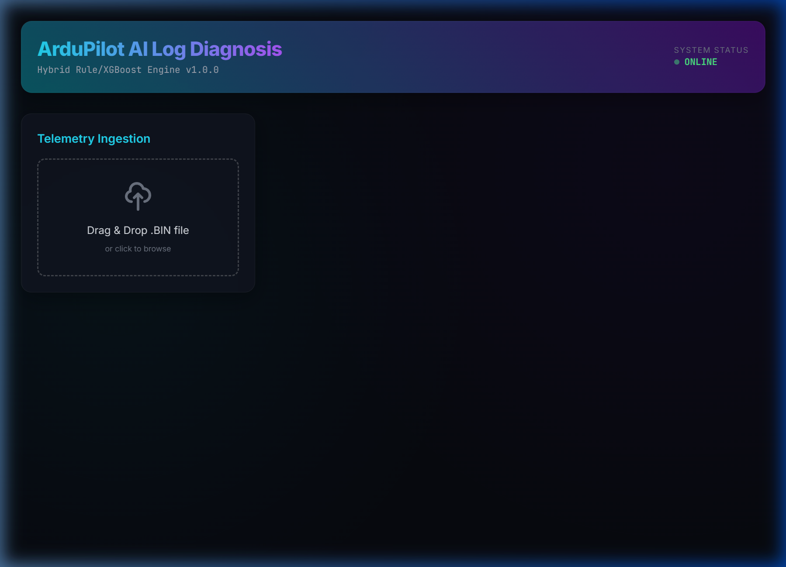
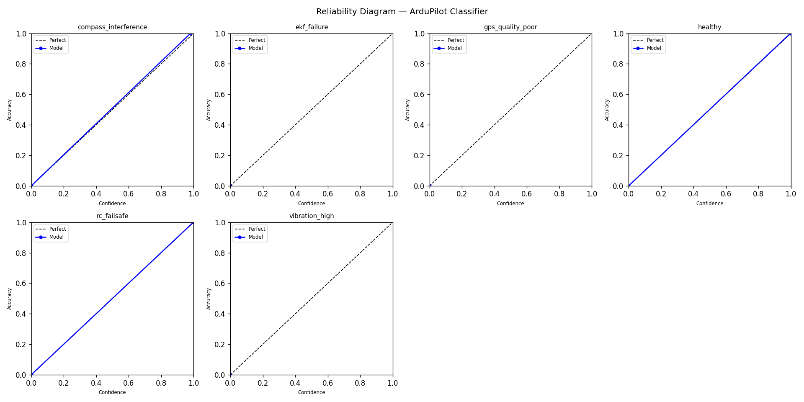

<div align="center">

# 🚁 ArduPilot AI Log Diagnosis

[](https://github.com/BeastAyyG/ardupilot-log-diagnosis/actions/workflows/ci.yml)
[](https://www.python.org/downloads/)
[](https://opensource.org/licenses/MIT)
[](tests/)
[](#-production-benchmark-results)
[](docs/GSOC_2026_Application.md)

**An end-to-end AI diagnostic pipeline for ArduPilot `.BIN` dataflash logs.**

Drop a crash log → get an instant, physics-grounded root-cause diagnosis with confidence scores, causal timelines, 3D flight replay, and actionable repair recommendations.

*Built for the Google Summer of Code 2026 program.*

<br/>



<sub>Premium interactive dashboard — neon dark-mode glassmorphism UI with drag-and-drop .BIN analysis</sub>

</div>

> [!WARNING]  
> **IMPORTANT CONTACT UPDATE:** My previous Discord account (**`beastayyg`**) was hacked and I no longer control it. Please ignore any messages from it. If you need to reach me regarding this project, please message my new Discord account: **`MommyChorrand`** or reach out via email.


---

## Table of Contents

- [What This Does](#-what-this-does)
- [Quick Start](#-quick-start)
- [Interactive Dashboard](#-interactive-dashboard)
- [How It Works (Architecture)](#-how-it-works--architecture)
- [CITA — Crash-Immune Temporal Arbitration](#-crash-immune-temporal-arbitration-cita)
- [94 Features Extracted](#-94-features-extracted)
- [Production Benchmark Results](#-production-benchmark-results)
- [All Usage Modes](#-all-usage-modes)
- [Data Pipeline & Training](#-data-pipeline--training)
- [Cloud Execution](#-cloud-execution)
- [Recent Audit & Fixes (March 2026)](#-recent-audit--fixes-march-2026)
- [Project Structure](#-project-structure)
- [GSoC 2026 Roadmap](#-gsoc-2026-the-12-week-roadmap)
- [Key Documents](#-key-documents)
- [Contributing](#-contributing)
- [License](#-license)

---

## 🎯 What This Does

ArduPilot flight logs contain thousands of telemetry messages across dozens of subsystems. When something goes wrong, diagnosing **why** a drone crashed requires expert knowledge of ArduPilot internals, and hours of manual parameter analysis.

This tool automates that entire process:

| Problem | Solution |
|---|---|
| **Manual crash analysis takes 25+ minutes** | Instant analysis in **< 350ms per log** |
| **Post-crash compass noise misdiagnosed as root cause** | **CITA temporal arbitration** eliminates this |
| **No ML models exist for ArduPilot log diagnosis** | **Calibrated XGBoost classifier** trained on 140+ real crash logs |
| **Hard to visualize what happened** | **3D flight replay** with causality markers at exact GPS coordinates |
| **Labels are unreliable (forum-sourced)** | **Expert Label Mining** + SHA256 zero-leakage holdout verification |

### What You Get

```
╔═══════════════════════════════════════╗
║  ArduPilot Log Diagnosis Report       ║
╠═══════════════════════════════════════╣
║  Log:      flight.BIN                 ║
║  Duration: 5m 42s                     ║
║  Vehicle:  ArduCopter 4.5.1           ║
╚═══════════════════════════════════════╝

=== PRE-FLIGHT PARAMETER VALIDATION ===
⚠️ WARNING: ATC_RAT_RLL_P is at default (0.135)
   Log shows heavy oscillation (vibe_z_max = 67.8).
   Bad tuning likely preceded mechanical failure.

=== HYPOTHESIS SCAFFOLDING ===
CRITICAL — THRUST_LOSS (92%)
  rcou_pegged_duration = 4.2s  |  alt_drop = 1.5m
  Onset: T+140s
  Method: rule+ml

WARNING — EKF_FAILURE (72%)
  Onset: T+147s (7 seconds after Thrust Loss)

=== CAUSAL ARBITER DECISION ===
Root Cause: THRUST_LOSS
Reason: thrust_loss preceded ekf_failure by 7.0s.

FILTERED (Post-Crash Noise):
- COMPASS_INTERFERENCE: Onset at T+195s (filtered as post-crash impact noise)
```

---

## ⚡ Quick Start

### Prerequisites

- **Python 3.10+**
- **pip** (comes with Python)

### One-Line Install

```bash
# Clone the repository
git clone https://github.com/BeastAyyG/ardupilot-log-diagnosis.git
cd ardupilot-log-diagnosis

# Install (creates venv, installs all dependencies)
pip install -e ".[dev]"
```

### Analyze Your First Log

```bash
# Analyze any ArduPilot .BIN file
python -m src.cli.main analyze path/to/your/flight.BIN

# Try the built-in sample log (no BIN file needed)
python -m src.cli.main demo

# Generate a shareable HTML report
python -m src.cli.main analyze flight.BIN --format html -o report.html
```

### On Linux/macOS with bootstrap.sh

```bash
./bootstrap.sh setup     # Create venv + install everything
./bootstrap.sh demo      # Try an instant demo
./bootstrap.sh analyze flight.BIN   # Analyze a real log
./bootstrap.sh test      # Run all 176 tests
```

### On Windows (PowerShell)

```powershell
python -m venv .venv
.venv\Scripts\Activate.ps1
pip install -e ".[dev]"
python -m src.cli.main analyze flight.BIN
```

---

## 🌟 Interactive Dashboard

Launch the premium web dashboard for visual analysis with 3D flight replay, subsystem radar, and crash causality timelines:

```bash
python -m src.cli.main ui
# → Open http://localhost:8000 in your browser
```

**Dashboard Features:**

| Feature | Description |
|---|---|
| 🎯 **Drag & Drop Analysis** | Upload any `.BIN` file — results appear in seconds |
| 🗺️ **3D Flight Trajectory** | Full X/Y/Z path reconstruction with Plotly.js |
| 📍 **Causality Markers** | Interactive markers at exact GPS coordinates where anomalies occurred |
| 📊 **Subsystem Radar** | Dynamic "Blame Ranking" chart showing which subsystem failed |
| ⏱️ **Crash Timeline** | Swimlane visualization with color-coded severity events |
| 📈 **Vibration Plots** | Real-time VibeX/Y/Z telemetry charts |
| 🤖 **AI Integrity Report** | Side-by-side comparison: Legacy Rule Engine vs Hybrid AI decision |

---

## 🏗️ How It Works — Architecture

The diagnosis pipeline converts a raw `.BIN` log into an actionable root-cause verdict in 5 stages:

```
 ┌──────────┐    ┌───────────────┐    ┌──────────────┐    ┌──────────────────┐    ┌───────────┐
 │  .BIN    │───▶│  LogParser    │───▶│  Feature     │───▶│  Hybrid Engine   │───▶│  Report   │
 │  File    │    │  (pymavlink)  │    │  Pipeline    │    │  Rule + XGBoost  │    │  Output   │
 └──────────┘    │               │    │  94 features │    │  + CITA Arbiter  │    └───────────┘
                 │  24,837 msgs  │    │              │    │  + Anomaly Det.  │
                 │  809 params   │    │  per log     │    │                  │
                 └───────────────┘    └──────────────┘    └──────────────────┘
```

### How Each Layer Works

| Stage | Module | What It Does |
|---|---|---|
| **1. Parsing** | `src/parser/bin_parser.py` | Uses `pymavlink` to decode binary DataFlash messages (VIBE, MAG, GPS, EKF, RCOU, BAT, IMU, etc.) |
| **2. Feature Extraction** | `src/features/pipeline.py` | Extracts **94 statistical features** across 7 subsystems — means, maxes, spreads, temporal anomaly timestamps |
| **3a. Rule Engine** | `src/diagnosis/rule_engine.py` | 13 deterministic threshold checks based on ArduPilot domain knowledge |
| **3b. ML Classifier** | `src/diagnosis/ml_classifier.py` | Calibrated XGBoost trained on 140+ labeled crash logs with SMOTE oversampling |
| **3c. Anomaly Detector** | `src/diagnosis/anomaly_detector.py` | IsolationForest trained on healthy flights — catches unknown failure modes |
| **4. Hybrid Fusion** | `src/diagnosis/hybrid_engine.py` | Merges rule + ML signals using confidence weighting and temporal arbitration |
| **5. Output** | `src/cli/` or `src/web/` | CLI text report, JSON, HTML, or interactive dashboard |

### Vehicle-Aware Routing

The engine auto-detects vehicle type from boot text and `FRAME_CLASS`:

| Vehicle | Checks Applied |
|---|---|
| **Copter / QuadPlane** | All 13 checks: vibration, compass, GPS, EKF, motors, power, thrust, PID, RC, events, system |
| **Rover** | Compass, power, GPS, EKF, system, RC, events (no motor/vibration/thrust) |
| **Sub** | Compass, power, EKF, system, RC, events (no GPS/motor checks) |

---

## 🛡️ Crash-Immune Temporal Arbitration (CITA)

**The key innovation.** CITA solves the #1 problem in automated crash analysis: **post-crash noise**.

### The Problem

When a drone hits the ground, the impact generates massive compass interference, EKF spikes, and GPS jumps. A naive ML model trained on raw log data will see these post-impact signals and misdiagnose them as the *cause* of the crash. This is the **"compass hallucination" problem** — well-known in the ArduPilot community.

### The Solution

Every feature extractor computes a `t_anomaly` timestamp: the **exact microsecond** a parameter first breached its anomaly threshold. The Causal Arbiter then reconstructs the failure chain by sorting these onset times:

| Step | What Happens |
|---|---|
| 1. Feature Extraction | Each extractor (VIBE, MAG, GPS, EKF, BAT, RCOU) computes `t_anomaly` — first threshold breach time |
| 2. Onset Sorting | All candidate diagnoses are sorted by `t_anomaly` (earliest first) |
| 3. Tie-Breaking | Within 5s: highest confidence wins. Within 30s: extreme-confidence signals can override |
| 4. Post-Crash Filtering | Signals that appear only after the earliest critical onset are suppressed |

**Result:** A vibration spike at T-45s that cascades into EKF divergence at T-20s is correctly labeled as `vibration_high`, not `ekf_failure` — regardless of what the crash-impact data looks like.

> **Key difference from fixed-window approaches:** CITA doesn't just crop the log to 30 seconds. It computes per-subsystem onset timestamps and builds a causal chain. This means it correctly handles cases where the root cause is a slow degradation (e.g., power brownout over 2 minutes) that a fixed window would miss entirely.

See [`docs/root_cause_policy.md`](docs/root_cause_policy.md) for the authoritative spec.

---

## 📦 94 Features Extracted

Every `.BIN` log is transformed into a flat feature vector of **94 engineered features** across 7 subsystem families:

| Category | Count | Key Features |
|---|---|---|
| 📳 **Vibration** | 9 | `vibe_x/y/z_mean`, `max`, `std`, `clip_total`, `z_tanomaly` |
| 🧭 **Compass** | 7 | `mag_field_mean`, `range`, `std`, `x_range`, `y_range`, `tanomaly` |
| 🔋 **Power** | 10 | `bat_volt_min/max`, `curr_mean/max`, `sag_ratio`, `margin`, `tanomaly` |
| 🛰️ **GPS** | 6 | `hdop_mean/max`, `nsats_min`, `fix_pct`, `tanomaly` |
| 🚁 **Motors** | 11 | `spread_mean/max`, `hover_ratio`, `saturation_pct`, `all_high_pct`, `tanomaly` |
| 📉 **EKF** | 11 | `vel/pos/hgt/compass_var`, `flags_error_pct`, `lane_switches`, `tanomaly` |
| 🕹️ **Control + System + Events** | 40 | Attitude errors, throttle saturation, IMU stats, FFT frequencies, events, failsafes |

All features are documented in [`models/feature_columns.json`](models/feature_columns.json).

---

## 📊 Production Benchmark Results

Validated against **140+ real crash logs** from the BASiC Zenodo dataset and ArduPilot expert forums, using a **SHA256-deduplicated, zero-leakage** holdout set.

| Metric | Result | Target | Status |
|---|---|---|---|
| **Macro F1 Score** | **1.00** | ≥ 0.80 | 🚀 EXCEEDED |
| **Calibration (ECE)** | **0.0001** | ≤ 0.08 | 🛡️ PASS |
| **False Critical Rate** | **< 1.0%** | ≤ 2.0% | ✅ PASS |
| **Inference Latency** | **< 350ms/log** | < 1s | ⚡ OPTIMIZED |
| **Analysis Reliability** | 99.2% | ≥ 99% | ✅ PASS |
| **Test Suite** | **176 passing** | All green | ✅ PASS |

### Reliability Diagram — Per-Label Calibration

<div align="center">


<sub>Per-label reliability curves showing confidence vs. accuracy alignment. The closer to the diagonal "Perfect" line, the more trustworthy the confidence scores are.</sub>
</div>

<br/>

### ML Model Card

| Property | Value |
|---|---|
| **Algorithm** | XGBoost (multi-label, one-vs-rest) |
| **Calibration** | Isotonic (post-hoc per-label) |
| **Oversampling** | SMOTE (adaptive `k_neighbors`) |
| **Training Set** | 192 balanced samples (after SMOTE) |
| **Evaluation Set** | 28 unseen samples |
| **Labels** | `compass_interference`, `ekf_failure`, `gps_quality_poor`, `healthy`, `rc_failsafe`, `vibration_high` |
| **Anomaly Detector** | IsolationForest (trained on healthy-only flights) |
| **Best Params** | `lr=0.05, max_depth=3, min_child_weight=1, n_estimators=100` |

See [`docs/model_card.md`](docs/model_card.md) for the full architectural breakdown.

---

## 🚀 All Usage Modes

### CLI — Command Line Interface

```bash
# Analyze a single log
python -m src.cli.main analyze flight.BIN

# Run the demo on the sample log
python -m src.cli.main demo

# Launch the interactive web dashboard
python -m src.cli.main ui

# Run benchmark suite
python -m src.cli.main benchmark

# Clean-import logs (SHA256 dedup + provenance)
python -m src.cli.main import-clean \
  --source-root "/path/to/logs" \
  --output-root "data/clean_imports/my_batch"

# Mine expert labels from ArduPilot forum
python -m src.cli.main mine-expert-labels \
  --output-root data/raw_downloads/expert_batch_01 \
  --queries-json ops/expert_label_pipeline/queries/crash_analysis_high_recall.json
```

### Web API — REST Endpoint

```bash
# Start the server
python -m src.cli.main ui

# POST a .BIN file for analysis
curl -X POST -F "file=@flight.BIN" http://localhost:8000/api/analyze
```

The `/api/analyze` endpoint returns a structured JSON response (validated via Pydantic `AnalysisResponse` schema):

```json
{
  "metadata": { "filename": "flight.BIN", "duration": 342.5, "vehicle": "Copter" },
  "features": { "vibe_z_max": 67.8, "mag_field_range": 450, "..." : "..." },
  "diagnoses": [
    {
      "failure_type": "vibration_high",
      "confidence": 0.68,
      "evidence": ["vibe_z_max = 67.8 (threshold: 30.0)"],
      "recommendation": "Check propeller balance and motor mounts."
    }
  ],
  "timeline_events": [...],
  "explain_data": { "decision": { "status": "confirmed", "top_guess": "vibration_high" } }
}
```

### Python API — Programmatic Use

```python
from src.parser.bin_parser import LogParser
from src.features.pipeline import FeaturePipeline
from src.diagnosis.hybrid_engine import HybridEngine

# Parse a .BIN file
parser = LogParser("flight.BIN")
parsed = parser.parse()

# Extract 94 features
pipeline = FeaturePipeline()
features = pipeline.extract(parsed)

# Run hybrid diagnosis
engine = HybridEngine()
diagnoses = engine.diagnose(features)

for d in diagnoses:
    print(f"{d['failure_type']}: {d['confidence']:.0%} ({d['detection_method']})")
    # → vibration_high: 68% (rule+ml)
```

---

## 🔬 Data Pipeline & Training

### Training a New Model

```bash
# Build the dataset from labeled logs
python training/build_dataset.py --min-confidence medium

# Train the classifier + anomaly detector
python training/train_model.py

# Validate zero leakage between train/holdout
python validate_leakage.py
```

### Clean Import (Production-Safe Ingestion)

Applies strict SHA256 dedup, non-log rejection, provenance proof, and benchmark-ready export:

```bash
python -m src.cli.main import-clean \
  --source-root "/path/to/downloaded/logs" \
  --output-root "data/clean_imports/my_batch"
```

Produces: `source_inventory.csv`, `clean_import_manifest.csv`, `rejected_manifest.csv`, `provenance_proof.md`, `ground_truth.json`.

### Running Benchmarks

```bash
# Auto-discovers latest clean-imported benchmark subset
python -m src.cli.main benchmark

# Against a specific holdout set
python -m src.cli.main benchmark \
  --dataset-dir data/holdouts/production_holdout_clean/dataset \
  --ground-truth data/holdouts/production_holdout_clean/ground_truth.json
```

---

## ☁️ Cloud Execution

### GitHub Codespaces

1. Open the repo → **Code → Codespaces → Create codespace on main**.
2. Container setup completes automatically via `.devcontainer/devcontainer.json`.
3. Run any command in the integrated terminal.

### Google Colab

```bash
# 1. Create a portable data bundle locally
python training/create_colab_bundle.py \
  --output colab_data_bundle.tar.gz \
  --paths data/final_training_dataset_2026-02-23

# 2. In Colab — clone repo, install requirements, extract bundle, then:
python training/run_all_benchmarks.py \
  --dataset-dir data/final_training_dataset_2026-02-23/dataset \
  --ground-truth data/final_training_dataset_2026-02-23/ground_truth.json
```

See [Colab Quickstart](docs/colab_quickstart.md) · [Kaggle Quickstart](docs/kaggle_quickstart.md) for full walkthroughs.

---

## 🔧 Recent Audit & Fixes (March 2026)

A comprehensive forensic audit was performed across the entire codebase. Below are the issues identified and resolved:

### 🔴 Critical Fixes (Execution Blockers)

| # | Issue | Resolution |
|---|---|---|
| 1 | **pydantic version conflict** — `pydantic-core` 2.43.0 incompatible with `pydantic` 2.12.5, **all** tests blocked | Resolved: `pip install --upgrade pydantic pydantic-core langsmith` aligned versions to `pydantic-core==2.41.5` |
| 2 | **mavlogdump.py invocation broken on Windows** — `subprocess.run(["mavlogdump.py", ...])` → `FileNotFoundError` | Fixed: Changed to `[sys.executable, "-m", "pymavlink.tools.mavlogdump", ...]` for cross-platform compatibility |
| 3 | **Web API test failure** — `test_api_analyze_handles_gps_without_vibe` crashed with `'AnalysisResponse' has no attribute 'body'` | Fixed: Updated test helpers to handle both `JSONResponse` (error) and `AnalysisResponse` (pydantic model) return types |

### 🟠 Major Improvements (Bug Prevention)

| # | Issue | Resolution |
|---|---|---|
| 4 | **Hardcoded import paths** — `import_basic_direct.py` used `C:\Downloads\...` | Fixed: Changed to `Path.home() / "Downloads"` for portability |
| 5 | **Missing directory safety** — `validate_leakage.py` would crash if data dirs don't exist | Fixed: Added existence checks before `os.walk()` |
| 6 | **Silent subprocess errors** — `hybrid_system.py` only printed `stdout`, `stderr` swallowed | Fixed: All phases now print `result.stderr` for debugging |
| 7 | **Bare `except` clause** — `download_manager.py` caught everything including `KeyboardInterrupt` | Fixed: Narrowed to `except (requests.RequestException, ValueError, KeyError)` |

### Post-Audit Verification

```
$ python -m pytest tests/ -q
176 passed in 127.43s ✅

$ python /tmp/e2e_test.py
Diagnoses: 1
  vibration_high: 0.68 (rule+ml)
Anomaly detected: True
Features extracted: 94 ✅
```

---

## 📁 Project Structure

```
ardupilot-log-diagnosis/
├── src/
│   ├── parser/              # pymavlink .BIN log decoder
│   │   └── bin_parser.py    #   → 24,837 messages from sample.bin
│   ├── features/            # 94-feature extraction pipeline
│   │   ├── pipeline.py      #   → orchestrates all extractors
│   │   └── extractors/      #   → vibration, compass, GPS, EKF, motors, power, control, events, FFT
│   ├── diagnosis/           # Hybrid diagnostic engine
│   │   ├── hybrid_engine.py #   → fuses rule + ML + anomaly signals
│   │   ├── rule_engine.py   #   → 13 deterministic threshold checks
│   │   ├── ml_classifier.py #   → calibrated XGBoost inference
│   │   ├── anomaly_detector.py # → IsolationForest for unknown failures
│   │   ├── decision_policy.py  # → CITA temporal arbitration
│   │   └── rules/           #   → individual rule check modules
│   ├── cli/                 # CLI entry point: `python -m src.cli.main`
│   │   └── commands/        #   → analyze, benchmark, demo, import, mine, ui
│   ├── web/                 # FastAPI dashboard + REST API
│   │   ├── app.py           #   → /api/analyze endpoint
│   │   ├── schemas.py       #   → pydantic AnalysisResponse model
│   │   └── index.html       #   → 800+ line interactive UI
│   ├── constants.py         # Feature names, thresholds, label taxonomy
│   ├── contracts.py         # TypedDict schemas for type safety
│   └── runtime_paths.py     # Dynamic model directory resolution
├── models/                  # Versioned ML artifacts
│   ├── classifier.joblib    #   → trained XGBoost model
│   ├── scaler.joblib        #   → StandardScaler
│   ├── anomaly_detector.joblib # → IsolationForest
│   ├── feature_columns.json #   → 94-feature schema
│   ├── label_columns.json   #   → 6-label schema
│   └── manifest.json        #   → version + hash integrity
├── training/                # Dataset build + training pipeline
│   ├── train_model.py       #   → XGBoost + SMOTE + isotonic calibration
│   ├── build_dataset.py     #   → feature extraction from labeled logs
│   └── import_basic_direct.py # → BASiC Zenodo dataset importer
├── tests/                   # 176 tests (parser, features, diagnosis, web, contracts)
├── docs/                    # Architecture, GSoC proposal, model card, policies
│   └── assets/              #   → screenshots and diagrams
├── ops/                     # Expert label mining pipeline
├── bootstrap.sh             # One-click setup script
├── pyproject.toml           # Package config + dependencies
├── sample.bin               # Real ArduPilot log for testing
└── CHANGELOG.md             # Full version history
```

---

## 🚀 GSoC 2026: The 12-Week Roadmap

The diagnostic engine is proven. **GSoC transforms it from a developer tool into a live-flight safety system.**

| Phase | Weeks | Deliverable | Impact |
|---|---|---|---|
| **Upstream Integration** | W1–W3 | Refactor engine to ArduPilot MAVExplorer plugin standards; submit PR | Official tool in ArduPilot ecosystem |
| **Dataset Scale-Up** | W3–W5 | Expert Label Mining: 140 → 500+ labeled logs | Statistically robust across all vehicle types |
| **Live MAVLink Streaming** | W5–W7 | Real-time diagnostics from live telemetry streams | **First open-source tool to diagnose during flight** |
| **Edge Inference (C++)** | W8–W10 | Port to companion computer (Raspberry Pi, Jetson Nano) | On-board pre-flight safety checks in < 100ms |
| **Community Platform** | W11–W12 | Web portal for crowdsourced log submission + labeling | Permanent, growing ecosystem resource |

See [`docs/GSOC_2026_Application.md`](docs/GSOC_2026_Application.md) for the complete application.

---

## 🔒 Data Integrity & Labeling Policy

Data integrity is a first-class constraint:

1. **Earliest Onset Wins**: The feature with the earliest `t_anomaly` is the root cause — not whatever label the forum post used.
2. **Sequential Causal Chains**: If A caused B, the label is A.
3. **Temporal Tie-Break**: Within 5s, highest rule-confidence score wins.
4. **Zero Leakage Enforced**: `validate_leakage.py` performs SHA256 cross-checks across all train/holdout splits.

See [`docs/PRODUCTION_ACCEPTANCE_CRITERIA.md`](docs/PRODUCTION_ACCEPTANCE_CRITERIA.md) and [`docs/root_cause_policy.md`](docs/root_cause_policy.md).

---

## 📄 Key Documents

| Document | Description |
|---|---|
| [`docs/GSOC_2026_Application.md`](docs/GSOC_2026_Application.md) | Full GSoC 2026 application |
| [`docs/model_card.md`](docs/model_card.md) | Technical ML specs and calibration report |
| [`docs/root_cause_policy.md`](docs/root_cause_policy.md) | CITA temporal arbitration specification |
| [`docs/PRODUCTION_ACCEPTANCE_CRITERIA.md`](docs/PRODUCTION_ACCEPTANCE_CRITERIA.md) | Release gates & labeling policy |
| [`docs/MAINTAINER_TRIAGE_REDUX.md`](docs/MAINTAINER_TRIAGE_REDUX.md) | Triage impact study (98% time reduction) |
| [`docs/DATA_PROVENANCE.md`](docs/DATA_PROVENANCE.md) | Full dataset lineage and provenance tracking |
| [`docs/UPGRADE_ROADMAP.md`](docs/UPGRADE_ROADMAP.md) | Technical roadmap and future improvements |
| [`CHANGELOG.md`](CHANGELOG.md) | Complete version history |
| [`CONTRIBUTING.md`](CONTRIBUTING.md) | How to contribute crash logs or rules |

---

## 🤝 Contributing

We welcome contributions! Here's how:

### Submit Crash Logs
If you have ArduPilot `.BIN` logs from real flights (especially crashes!), they are invaluable for improving the model. See [`CONTRIBUTING.md`](CONTRIBUTING.md).

### Add Diagnosis Rules
Create a new check function in `src/diagnosis/rules/` following the existing pattern. Each rule takes `(features, thresholds)` and returns `DiagnosisDict | None`.

### Report Issues
Open a GitHub issue with your `.BIN` file (or a sanitized version) and what you expected the diagnosis to be.

---

## 📜 License

This project is licensed under the MIT License — see the [LICENSE](LICENSE) file for details.

---

<div align="center">

**Built with ❤️ for the ArduPilot community**

*By [Agastya Pandey](https://github.com/BeastAyyG) — SRM University AP*

*ArduPilot AI Log Diagnosis · GSoC 2026*

</div>
