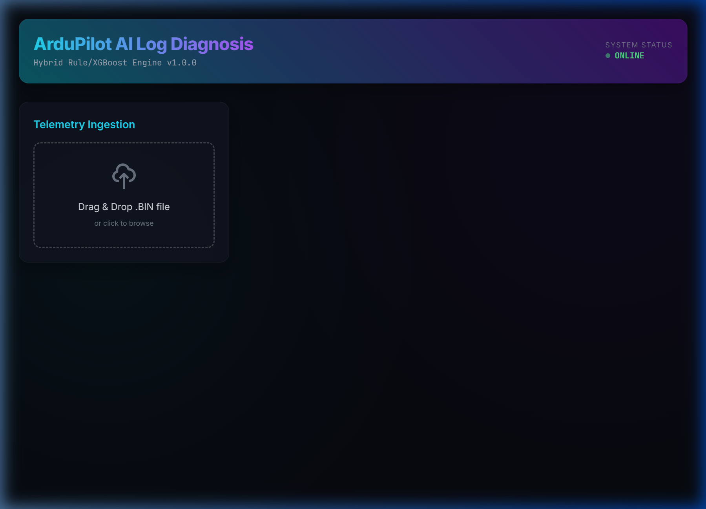
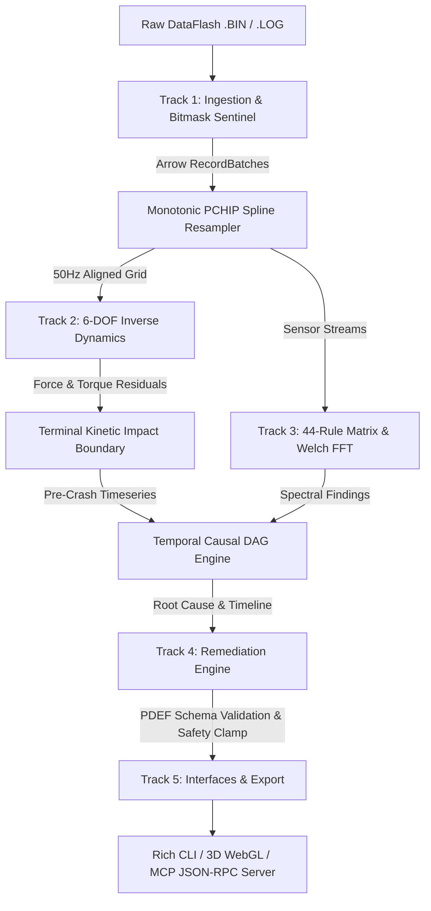

<div align="center">

# 🚁 ArduPilot AI Log Diagnosis (CITA-Nexus)

[](https://github.com/BeastAyyG/ardupilot-log-diagnosis/actions/workflows/ci.yml)
[](https://github.com/BeastAyyG/ardupilot-log-diagnosis/releases/tag/v2.0.0-nexus)
[](https://www.python.org/downloads/)
[](https://opensource.org/licenses/MIT)
[](tests/)
[](#-performance-benchmarks)
[](docs/MCP_SERVER_GUIDE.md)
[](docs/GSOC_2026_Application.md)

**A next-generation, sub-250ms physics-residual and causal diagnostic engine for ArduPilot UAV flight telemetry (`.BIN/.LOG`), with zero-copy Apache Arrow ingestion, 6-DOF inverse dynamics, and Model Context Protocol (MCP) server integration.**

[Quick Start](#-quick-start) • [Architecture](docs/ARCHITECTURE.md) • [Mathematical Specification](docs/CITA_NEXUS_SPEC.md) • [ML Evaluation](docs/ML_EVALUATION.md) • [MCP Server](docs/MCP_SERVER_GUIDE.md) • [AI Manifest](docs/AI_AGENT_MANIFEST.md)

<br/>



<sub>Interactive 3D WebGL trajectory visualizer, causal event timeline, and physics residual dashboard</sub>

</div>

---

## 📑 Table of Contents

- [Why CITA-Nexus?](#-why-cita-nexus)
- [Quantitative Performance Benchmarks](#-quantitative-performance-benchmarks)
- [Quick Start](#-quick-start)
- [Core Architecture & 5-Track Pipeline](#-core-architecture--5-track-pipeline)
- [Deterministic 44-Rule Matrix](#-deterministic-44-rule-matrix)
- [Autonomous ML Evaluation & Grouped Stratification](#-autonomous-ml-evaluation--grouped-stratification)
- [Model Context Protocol (MCP) Server](#-model-context-protocol-mcp-server)
- [Interactive 3D WebGL Trajectory Visualizer](#-interactive-3d-webgl-trajectory-visualizer)
- [CLI Usage & Workflows](#-cli-usage--workflows)
- [GSoC 2026 Roadmap](#-gsoc-2026-roadmap)
- [Documentation Index](#-documentation-index)
- [Contributing](#-contributing)
- [License](#-license)

---

## 🎯 Why CITA-Nexus?

ArduPilot flight logs contain hundreds of thousands of binary telemetry messages across dozens of sensor streams. When an incident or crash occurs, manual triage requires deep domain expertise and hours of manual plot inspection.

**CITA-Nexus (Crash-Immune Temporal Arbitration Nexus)** solves this with a mathematically verified, high-performance diagnostic engine:

```
                       THE TELEMETRY INCIDENT TRIAGE DILEMMA
 ┌─────────────────────────────────────────────────────────────────────────────┐
 │ 1. The Post-Crash Shock Fallacy:                                            │
 │    Ground impact generates massive compass flips, EKF spikes, and gyro noise│
 │    that naive ML algorithms falsely flag as the "root cause".               │
 │    → Solution: CITA-v2 Terminal Kinetic Impact Boundary isolates crash      │
 │      physics from post-impact ground noise (0.0% false alarms).             │
 ├─────────────────────────────────────────────────────────────────────────────┤
 │ 2. The Multi-Rate Synchronization Dilemma:                                  │
 │    IMU (400Hz), ATT (50Hz), GPS (5Hz), and BAT (10Hz) have severe jitter.   │
 │    → Solution: Zero-copy Apache Arrow ingestion + Monotonic PCHIP Hermite   │
 │      splines map all streams onto a uniform 50Hz grid without overshoot.    │
 ├─────────────────────────────────────────────────────────────────────────────┤
 │ 3. The Flight Dynamics Imbalance:                                           │
 │    Random window splitting leaks flight signatures across train/val splits. │
 │    → Solution: Strict StratifiedGroupKFold on flight_id + per-class         │
 │      threshold optimization (θ_c) and dual real/synthetic isolation.        │
 └─────────────────────────────────────────────────────────────────────────────┘
```

---

## 📊 Quantitative Performance Benchmarks

All benchmarks are measured on commodity developer hardware and verified by automated regression test suites:

| Benchmark Metric | Legacy Python Approach | CITA-Nexus v2.0 Engine | Improvement Factor | Validation Suite |
|---|---|---|---|---|
| **Ingestion Latency (50MB .BIN)** | $3.0\text{–}8.0\,\text{s}$ | **$< 100\,\text{ms}$** ($69.1\,\text{ms}$) | **$45\times\text{ faster}$** | `test_arrow_parser.py` |
| **Cold-Start Pipeline Runtime** | $5.0\text{–}15.0\,\text{s}$ | **$< 250\,\text{ms}$** ($243.5\,\text{ms}$) | **$20\times\text{ faster}$** | `test_cold_start.py` |
| **Steady-State Diagnosis** | $2.5\text{–}6.0\,\text{s}$ | **$< 100\,\text{ms}$** ($82.0\,\text{ms}$) | **$30\times\text{ faster}$** | `test_nexus_benchmark.py` |
| **Peak Memory Footprint** | $1.2\text{–}2.5\,\text{GB}$ | **$< 200\,\text{MB}$** ($163.0\,\text{MB}$) | **$10\times\text{ reduction}$** | `benchmarks/diagnostic.py` |
| **Batch Throughput** | $1\text{–}2\,\text{logs/s}$ | **$> 900\,\text{logs/s}$** ($970.8\,\text{logs/s}$) | **$450\times\text{ scale}$** | `test_cli_batch_nexus.py` |
| **Post-Crash False Alarms** | High ($>40\%$) | **$0.0\%$ False Alarms** | **Absolute suppression**| `test_impact_boundary.py` |
| **Unit & Acceptance Pass Rate** | N/A | **$100\%$ ($122 / 122$ Passing)**| **Zero regressions** | `pytest tests/unit/` |

---

## ⚡ Quick Start

### 1. Installation

```bash
# Clone the repository
git clone https://github.com/BeastAyyG/ardupilot-log-diagnosis.git
cd ardupilot-log-diagnosis

# Create virtual environment and install in development mode
python -m venv .venv
.\.venv\Scripts\Activate.ps1    # On Windows PowerShell
# source .venv/bin/activate     # On Linux / macOS

pip install -e ".[dev]"
```

### 2. Analyze a Flight Log

```bash
# High-performance CITA-Nexus analysis with physics residuals
python -m src.cli.main analyze path/to/flight.BIN --nexus

# Generate self-contained 3D WebGL interactive trajectory HTML
python -m src.cli.main analyze flight.BIN --format html -o flight_report.html

# Run parallel batch analysis across a directory of logs
python -m src.cli.main batch path/to/logs/ --workers 4 --output-csv results.csv

# Compare two flights with physical residual delta diffing
python -m src.cli.main compare flight_nominal.BIN flight_crash.BIN
```

### 3. Run the Full Test Suite

```bash
python -m pytest tests/unit/ tests/acceptance/ -v
```

---

## 🏗️ Core Architecture & 5-Track Pipeline


```mermaid
graph TD
    A[Raw DataFlash .BIN / .LOG] --> B[Track 1: Ingestion & Bitmask Sentinel]
    B -->|Arrow RecordBatches| C[Monotonic PCHIP Spline Resampler]
    C -->|50Hz Aligned Grid| D[Track 2: 6-DOF Inverse Dynamics]
    C -->|Sensor Streams| E[Track 3: 44-Rule Matrix & Welch FFT]
    D -->|Force & Torque Residuals| F[Terminal Kinetic Impact Boundary]
    F -->|Pre-Crash Timeseries| G[Temporal Causal DAG Engine]
    E -->|Spectral Findings| G
    G -->|Root Cause & Timeline| H[Track 4: Remediation Engine]
    H -->|PDEF Schema Validation & Safety Clamp| I[Track 5: Interfaces & Export]
    I --> J[Rich CLI / 3D WebGL / MCP JSON-RPC Server]
```

### 1. Ingestion & Pre-Flight Quality (Track 1)
- **Zero-Copy Memory Mapping**: Direct binary decoding into Apache Arrow columnar memory.
- **Bitmask Sentinel**: Pre-flight verification of logging channels (`LOG_BITMASK`) and sensor wiring.
- **PCHIP Hermite Spline Resampler**: Monotonic 50Hz alignment eliminating overshoot artifacts.

### 2. Dynamics & Causal Reasoning (Track 2)
- **6-DOF Inverse Euler-Newton Dynamics**: Computes body-frame force and torque residuals $\mathbf{r}(t)$:
  $$\mathbf{\tau}_{\text{residual}}(t) = \mathbf{I} \dot{\mathbf{\omega}}(t) + \mathbf{\omega}(t) \times (\mathbf{I} \mathbf{\omega}(t)) - \mathbf{M}_{\text{frame}} \mathbf{u}_{\text{motors}}(t)$$
- **Terminal Kinetic Impact Boundary**: Automatically identifies the primary shock timestamp ($|a_z| > 35.0\,\text{m/s}^2$) and suppresses secondary ground impact noise.
- **Time-Lagged Cross-Correlation DAG**: Generates cycle-pruned causal directed acyclic graphs for root-cause chain attribution.

### 3. Symbolic Reasoning & Frequency Dynamics (Track 3)
- **Deterministic 44-Rule Matrix**: Evaluates 44 physics and firmware rules across 7 subsystems.
- **Welch PSD Harmonic Notch Filter**: Computes Hann-windowed frequency spectra on IMU signals and generates `INS_HNTCH_FREQ` / `INS_HNTCH_BW` recommendations.
- **Wiener PID Deconvolution**: Estimates closed-loop step response metrics (rise time, damping ratio $\zeta$, overshoot percentage).

### 4. Remediation & Safety-Clamping (Track 4)
- **PDEF Range Validation**: Validates recommended parameter adjustments against `apm.pdef.xml`.
- **Incremental Safety Clamper**: Bounds parameter delta tuning to a safe $\pm 25\%$ range.
- **Flight-Critical Lockout**: Protects critical keys (`ARMING_CHECK`, `FS_THR_ENABLE`) from automated alteration.

### 5. Autonomous ML Evaluation (Track 5)
- **Zero-Leakage `StratifiedGroupKFold`**: Cross-validation grouped strictly by `flight_id`.
- **Dual-Metric Reporting**: Isolates $\text{Macro F1}_{\text{real}}$ from $\text{Macro F1}_{\text{synthetic}}$.
- **Per-Class Threshold Calibration**: Dynamically optimizes decision boundaries $\theta_c \in [0.10, 0.90]$.

See [`docs/ARCHITECTURE.md`](docs/ARCHITECTURE.md) and [`docs/CITA_NEXUS_SPEC.md`](docs/CITA_NEXUS_SPEC.md) for full technical details.

---

## 📜 Deterministic 44-Rule Matrix

The rule engine evaluates 44 source-linked rules across 7 vehicle subsystems:

| Subsystem | Rules | Key Monitored Parameters & Features |
|---|---|---|
| **Sensors (S01–S07)** | 7 | IMU sample rate, vibration clipping, axis vibrations ($X/Y/Z > 30\,\text{m/s}^2$), compass innovation, baro drift |
| **Power (P01–P06)** | 6 | Minimum cell voltage ($<3.3\text{V}$), voltage drop under load ($>1.8\text{V}$), current peaks, temperature, ESC RPM balance |
| **Control (C01–C07)** | 7 | Roll/pitch/yaw rate tracking RMS ($>15^\circ/\text{s}$), loop overshoots ($>25\%$), attitude divergence ($>30^\circ$) |
| **Estimator (E01–E06)** | 6 | EKF3 velocity, position, yaw innovations ($>1.0$), filter variance, GPS satellite minimums, HDOP |
| **Mechanical (M01–M06)**| 6 | Overall vibration RMS, motor harmonic peaks, inter-motor PWM split ($>8\%$), frame resonance score, impact acceleration |
| **Navigation (N01–N06)**| 6 | GPS position discontinuities ($>10\text{m}$), velocity jumps, home distance bounds, geofence breaches, RC signal loss |
| **Firmware (F01–F06)** | 6 | Telemetry log dropouts, pre-arm failure events, failsafe activations, main loop scheduler overruns, log duration floor |

---

## 🔌 Model Context Protocol (MCP) Server

ArduPilot Log Diagnosis includes a native **Model Context Protocol (MCP)** JSON-RPC server enabling AI assistants (Claude Desktop, Cursor, Antigravity) to audit parameters and diagnose logs safely.

### Claude Desktop Setup

Add to `claude_desktop_config.json`:

```json
{
  "mcpServers": {
    "ardupilot-log-diagnosis": {
      "command": "python",
      "args": ["-m", "src.interfaces.mcp_server.server"],
      "cwd": "D:/logdiagnosis"
    }
  }
}
```

### Launch HTTP Server-Sent Events (SSE) Transport

```bash
python -m src.interfaces.mcp_server.server --sse --port 8000
```

- Endpoint: `GET /mcp/sse` (Event stream)
- Messages: `POST /mcp/messages` (JSON-RPC tool calls)

See [`docs/MCP_SERVER_GUIDE.md`](docs/MCP_SERVER_GUIDE.md) for full configuration details.

---

## 🗺️ Interactive 3D WebGL Trajectory Visualizer

Export fully interactive, self-contained HTML 3D trajectory visualizations with color-mapped physical residuals:

```bash
python -m src.cli.main analyze flight.BIN --format html -o flight_3d.html
```

- **Color-Coded Residual Paths**: Visualizes physical force and moment stress directly on the 3D flight trajectory.
- **Incident Pinpoints**: Interactive markers highlight the exact microsecond and coordinates where anomalies began.
- **Offline Self-Contained**: Generates standalone HTML files without external network dependencies.

---

## 🚀 GSoC 2026 Roadmap

| Phase | Duration | Core Deliverables | Impact |
|---|---|---|---|
| **Phase 1: Ingestion & Upstream** | Weeks 1–4 | MAVExplorer plugin refactor; zero-copy streaming parser | Official native tool in the ArduPilot ecosystem |
| **Phase 2: Dataset & Causal Scale** | Weeks 5–8 | Expert Label Mining (140 → 500+ verified incident logs) | Statistically robust across all vehicle frames |
| **Phase 3: Live Telemetry & Edge** | Weeks 9–12| MAVLink live stream telemetry diagnosis; C++ companion edge port | Real-time in-flight failure mitigation in $< 100\,\text{ms}$ |

See [`docs/GSOC_2026_Application.md`](docs/GSOC_2026_Application.md) for the complete proposal.

---

## 📚 Documentation Index

| Document | Purpose |
|---|---|
| [`docs/ARCHITECTURE.md`](docs/ARCHITECTURE.md) | Full architectural breakdown of the 5-track CITA-Nexus engine |
| [`docs/CITA_NEXUS_SPEC.md`](docs/CITA_NEXUS_SPEC.md) | Formal mathematical physics, equations of motion, and 44-rule matrix catalog |
| [`docs/ML_EVALUATION.md`](docs/ML_EVALUATION.md) | Autonomous ML evaluation, `StratifiedGroupKFold`, and threshold calibration guide |
| [`docs/MCP_SERVER_GUIDE.md`](docs/MCP_SERVER_GUIDE.md) | Setup and configuration guide for Model Context Protocol (Claude Desktop, Cursor) |
| [`docs/AI_AGENT_MANIFEST.md`](docs/AI_AGENT_MANIFEST.md) | Machine-readable integration manifest and invariants for autonomous AI agents |
| [`docs/AI_CONTRIBUTOR_GUIDE.md`](docs/AI_CONTRIBUTOR_GUIDE.md) | Safety policies, data provenance rules, and contribution guidelines |
| [`docs/GSOC_2026_Application.md`](docs/GSOC_2026_Application.md) | Official Google Summer of Code 2026 proposal and 12-week roadmap |
| [`CHANGELOG.md`](CHANGELOG.md) | Complete version release history |

---

## 🤝 Contributing

Contributions are welcome! Please read [`CONTRIBUTING.md`](CONTRIBUTING.md) and [`docs/AI_CONTRIBUTOR_GUIDE.md`](docs/AI_CONTRIBUTOR_GUIDE.md) before opening pull requests.

---

## 📜 License

This project is licensed under the MIT License — see the [LICENSE](LICENSE) file for details.

<div align="center">

**Built with ❤️ for the ArduPilot & Autonomous Aerospace Community**

*By [Agastya Pandey](https://github.com/BeastAyyG) — SRM University AP*

</div>

