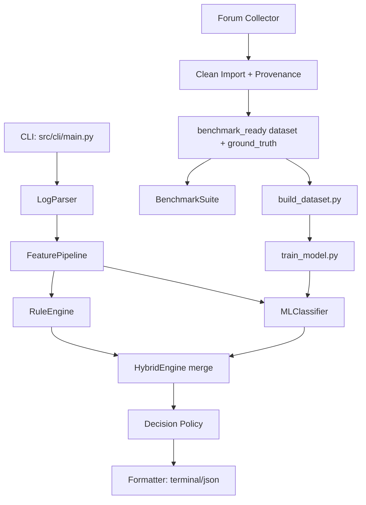

# ArduPilot Log Diagnosis - Deep Program Understanding

## 1) Executive Summary

This repository is a CLI-first backend system for diagnosing ArduPilot DataFlash `.BIN` logs using a hybrid architecture:

- Deterministic telemetry parsing (`pymavlink`)
- Multi-family feature extraction (vibration, compass, power, GPS, motor, EKF, control, system, events, FFT)
- Rule-based diagnosis heuristics
- Optional ML multi-label classifier (when model artifacts exist)
- A hybrid merger with temporal root-cause arbitration and safety decision gating
- Benchmarking, provenance-safe data ingestion, and training utilities

The project is positioned as a practical engineering tool plus a research pipeline: it supports direct single-log diagnosis while also operating an end-to-end data curation and benchmarking workflow for continuous improvement.


## 2) What the Program Is Really Solving

The system solves a hard real-world problem: converting noisy, inconsistent, partially missing telemetry logs into actionable failure hypotheses with confidence and evidence.

It does this by separating concerns:

1. **Log decoding layer** - robustly parse `.BIN` into structured message dictionaries.
2. **Feature layer** - normalize variable log shapes into fixed numeric vectors.
3. **Diagnosis layer** - apply interpretable rules and (optionally) statistical ML.
4. **Decision layer** - enforce safety-first abstention/review logic.
5. **Data lifecycle layer** - collect, verify provenance, dedupe, label-map, benchmark, and retrain.


## 3) Repository Topology and Active Boundaries

### Active runtime path

- Entry point: `src/cli/main.py`
- Core domain code: `src/parser`, `src/features`, `src/diagnosis`, `src/benchmark`, `src/data`
- Training/data operations: `training/`

### Legacy/compatibility areas

- Older standalone scripts: `diagnosis_engine.py`, `feature_extractor.py`
- Recovery archive: `recovered_from_ardupilot_folder/`

### Deliberate boundary

- Main diagnosis app data: `data/`
- Separate companion-health app data: `companion_health/`
- Boundary integrity checks: `training/validate_project_boundaries.py`


## 4) High-Level Architecture




## 5) End-to-End Runtime Flows

### 5.1 Single log diagnosis (`analyze`)

1. Parse `.BIN` into normalized structures (`metadata`, `messages`, `parameters`, `events`, etc.).
2. Extract a dense feature dictionary via all extractor modules.
3. Choose engine:
   - `RuleEngine` if `--no-ml`
   - `HybridEngine` otherwise
4. Produce diagnoses (failure type, confidence, severity, evidence, recommendation).
5. Run `evaluate_decision` to determine `healthy/uncertain/confirmed` and review requirement.
6. Format as terminal report or JSON.

### 5.2 Benchmark run (`benchmark`)

1. Resolve dataset + ground truth paths (supports fallback to latest clean-import benchmark set).
2. For each labeled log:
   - parse -> feature extract -> diagnose
3. Compute metrics (`accuracy`, `top1_accuracy`, `exact_match_accuracy`, `macro_f1`, per-label confusion stats).
4. Emit `.md` + `.json` artifacts.

### 5.3 Data growth and curation

1. `collect-forum`: scrape forum search results and attachments.
2. `import-clean`: strict validation, parse-probe, SHA dedupe, provenance linkage, taxonomy filtering.
3. Emit benchmark-ready subset plus manifests and proof reports.

### 5.4 Training loop

1. Build feature/label CSVs from ground truth.
2. Train RF + XGBoost one-vs-rest candidates.
3. Select best by macro F1.
4. Save model + scaler + schema artifacts to `models/`.


## 6) Core Module Deep Dive

### 6.1 Parser (`src/parser/bin_parser.py`)

**Responsibilities**

- Stream read DataFlash logs via `DFReader_binary`.
- Keep metadata (`duration_sec`, `vehicle_type`, firmware, message counts).
- Persist selected message types only (memory-conscious).
- Normalize ERR/EV/MODE semantics and attach auto-label hints.

**Data contract output**

- `metadata`
- `messages` (message type -> list of dicts)
- `parameters`
- `errors`, `events`, `mode_changes`, `status_messages`

**Design intent**

- Safe failure behavior: parser returns structured empty payload instead of crashing when file is missing/corrupt.


### 6.2 Feature pipeline (`src/features/pipeline.py`)

The pipeline orchestrates 12 extractors and always returns a full numeric feature set (real values or zeros).

| Extractor | Primary messages | Output focus |
|---|---|---|
| `VibrationExtractor` | `VIBE` | axis stats, clipping, temporal anomaly |
| `CompassExtractor` | `MAG` | field magnitude/range/std, temporal anomaly |
| `PowerExtractor` | `BAT` + params | voltage/current stats, margin/sag, temporal anomaly |
| `GPSExtractor` | `GPS` | HDOP, sats, fix ratio, temporal anomaly |
| `MotorExtractor` | `RCOU` | spread/output/hover ratio, temporal anomaly |
| `AttitudeExtractor` | `ATT` | roll/pitch stability and command error |
| `EKFExtractor` | `XKF4`/`NKF4` | variance families, lane switches, EKF flags |
| `IMUExtractor` | `IMU` | accelerometer/gyro std |
| `ControlExtractor` | `CTUN` | throttle/altitude/climb stability |
| `SystemExtractor` | `PM` (+ `POWR` if present) | loops/load/internal errors/voltage rails |
| `EventExtractor` | `ERR`/`EV`/`MODE` | failsafe, mode, crash, GPS lost, RC-loss counts |
| `FFTExtractor` | `FTN1`/`IMU` | vibration spectral proxy metrics |

`_metadata` includes extraction timing, message coverage, and event auto-label hints.


### 6.3 Rule engine (`src/diagnosis/rule_engine.py`)

Rule checks implemented:

- `vibration_high`
- `compass_interference`
- `power_instability` / `brownout`
- `gps_quality_poor`
- `motor_imbalance` / `pid_tuning_issue`
- `ekf_failure`
- `mechanical_failure`
- `rc_failsafe`

Outputs are structured diagnosis objects with explicit evidence and recommendations.


### 6.4 ML classifier (`src/diagnosis/ml_classifier.py`)

**Behavior model**

- Loads persisted model + scaler + feature/label schemas from `models/`.
- If artifacts missing/unreadable, sets `available = False` and returns no ML diagnoses.
- Uses per-label probability thresholds.
- Applies contextual override logic to disambiguate vibration vs compass interference.
- Caps output labels (`MAX_PREDICTED_LABELS = 3`).


### 6.5 Hybrid engine (`src/diagnosis/hybrid_engine.py`)

**Merge policy**

- rule+ml: weighted blend
- ml-only: discounted confidence
- rule-only: discounted confidence
- confidence floor gate

**Ranking policy**

- sort by confidence, detection method quality, and label priority

**Temporal Arbiter**

- uses `{feature_prefix}_tanomaly` timestamps to pick earliest-onset root cause
- tie-breaking by confidence within a 5-second window

**Symptom cascade filter**

- if arbiter does not trigger, keeps strong secondaries only (gap and method constraints)


### 6.6 Decision policy (`src/diagnosis/decision_policy.py`)

Provides a safety gate on top of diagnosis ranking:

- `healthy` when no diagnosis
- `uncertain` when low top confidence, close top-2 gap, multi-high-confidence conflict, or moderate ML-only top result
- `confirmed` otherwise

This is the explicit operator-trust bridge: it says when humans must review.


### 6.7 Benchmarking (`src/benchmark/*`)

`BenchmarkSuite` handles parse/extract/diagnose loops over labeled datasets and records structured failures.

`BenchmarkResults` computes:

- per-label TP/FP/FN/TN + precision/recall/F1
- three notions of "accuracy":
  - any-match accuracy (`overall.accuracy`)
  - top-1 accuracy (`overall.top1_accuracy`)
  - exact-set accuracy (`overall.exact_match_accuracy`)


### 6.8 Data ingestion and provenance (`src/data/clean_import.py`, `src/data/forum_collector.py`)

This is one of the strongest engineering parts of the repo.

**Collector**

- forum query crawl -> topic/post extraction -> attachment URL normalization
- supports Dropbox/Google Drive download URL normalization
- saves manifest + summary with status categories

**Clean import quality gates**

- binary signature checks (reject image/html/pdf masquerading as `.bin`)
- parse-probe gate (`DFReader`) for log validity
- SHA256 dedupe
- provenance mapping from manifests
- label taxonomy mapping and provisional exclusion policy
- synthetic/SITL exclusion

**Outputs**

- inventories, clean/rejected manifests, candidate and benchmark-ready ground truth, provenance proof markdown


### 6.9 Training scripts (`training/*`)

The training stack is operationalized but still maturing:

- `build_dataset.py`: creates supervised feature/label matrices with confidence and trainable filters
- `train_model.py`: RF vs XGBoost model selection, writes artifacts
- `create_unseen_holdout.py`: SHA-unseen holdout generation
- `run_all_benchmarks.py`: orchestration across engines
- `build_real_training_pool.py`: builds real-only pool from verified + manual review labels


### 6.10 Retrieval (`src/retrieval/similarity.py`)

Implements cosine similarity against `known_failures.json` feature vectors.

Purpose: nearest-case retrieval for operator context, not core diagnosis.


## 7) Data Contracts and Artifact Semantics

### 7.1 Diagnosis object contract

Each diagnosis entry follows this shape:

- `failure_type`
- `confidence` (0..1)
- `severity`
- `detection_method`
- `evidence` (feature-threshold facts)
- `recommendation`

### 7.2 Ground truth contract

Primary fields in each log entry:

- `filename`
- `labels` (multi-label list)
- `source_url`
- `source_type`
- `expert_quote`
- `confidence`
- optional `trainable` in some datasets

### 7.3 Provenance artifacts

Key clean-import deliverables:

- source inventory (CSV/JSON)
- clean import manifest (CSV/JSON)
- rejected manifest
- candidate ground truth
- benchmark-ready ground truth
- provenance proof markdown


## 8) Current Runtime Health (Observed)

I executed the test suite (`pytest -q`) during this analysis.

- Total: **48 tests**
- Passing: **35**
- Failing: **13**

Primary failure cluster:

1. **Hard runtime defect in `RuleEngine`**
   - `RuleEngine.diagnose()` references `self._check_events`.
   - `_check_events` method is missing, causing `AttributeError` and breaking CLI diagnosis paths.
   - Evidence: failures in `tests/test_cli.py` and `tests/test_diagnosis.py`.

2. **Feature schema drift**
   - `FeaturePipeline.get_feature_names()` returns 89 features.
   - `src.constants.FEATURE_NAMES` contains 87.
   - Missing constants entries: `evt_radio_failsafe_count`, `evt_rc_lost_count`.


## 9) Important Technical Gaps and Risks

### 9.1 Parser/extractor message mismatch

- Parser stores only a whitelist of message types.
- Extractors depend on message types not currently retained:
  - `IMUExtractor` requires `IMU` but parser does not store `IMU`.
  - `SystemExtractor` uses `POWR` rails but parser does not store `POWR`.
- Operational impact: some system/IMU features silently remain zero and can suppress related detections.

### 9.2 Threshold configuration mismatch

- `models/rule_thresholds.yaml` key names do not fully align with keys read in `RuleEngine`.
- Several intended threshold overrides may never apply.

### 9.3 ML readiness mismatch

- `models/` currently lacks `classifier.joblib` and `scaler.joblib` in this workspace state.
- `MLClassifier` will therefore be unavailable and Hybrid behaves effectively rule-centric.
- Persisted `feature_columns.json` and `label_columns.json` reflect older/limited schema coverage.

### 9.4 Benchmark metric naming ambiguity

- `overall.accuracy` is any-match accuracy, not exact-match.
- Some report labels still describe it as exact match, which can mislead model interpretation.


## 10) Professional Assessment of System Maturity

### Strengths

- Clear modular design with good separations of concern.
- Strong provenance and data curation discipline (rare and valuable in ML tooling).
- Good safety-aware decision policy layer.
- Practical CLI ergonomics and benchmark reporting support.

### Weaknesses

- Current branch has a blocking diagnosis bug (`_check_events` missing).
- Feature-schema and parser-schema drift indicate integration discipline gaps.
- ML artifacts and schema are not synchronized with latest feature design.
- Some heuristic extractors still contain placeholder logic.

### Overall

Architecturally, this is a serious and thoughtfully structured system. Operationally, it is in a transition state where data pipeline sophistication is ahead of core inference-path stability. Fixing schema consistency and restoring the rule pipeline integrity would quickly raise reliability.


## 11) Recommended Near-Term Hardening Plan

1. Restore/implement `_check_events` as a proper method and re-run tests.
2. Unify feature schema source of truth:
   - align `FEATURE_NAMES`, extractor outputs, model feature columns.
3. Align parser message whitelist with extractor dependencies (`IMU`, `POWR`).
4. Normalize threshold key naming across constants, YAML, and rule engine reads.
5. Standardize benchmark metric names in terminal/markdown outputs.
6. Rebuild ML artifacts from current schema and validate on both in-scope and SHA-unseen holdouts.


## 12) Practical Command Map

### Diagnosis

```bash
python -m src.cli.main analyze <path/to/log.BIN>
python -m src.cli.main analyze <path/to/log.BIN> --json
python -m src.cli.main features <path/to/log.BIN>
```

### Benchmark

```bash
python -m src.cli.main benchmark
python -m src.cli.main benchmark --engine hybrid --dataset-dir <dataset> --ground-truth <gt.json>
python training/run_all_benchmarks.py --dataset-dir <dataset> --ground-truth <gt.json> --output-dir <out>
```

### Data growth and curation

```bash
python -m src.cli.main collect-forum --output-root data/raw_downloads/<batch>
python -m src.cli.main import-clean --source-root data/raw_downloads/<batch> --output-root data/clean_imports/<batch>
```

### Training

```bash
python training/build_dataset.py --ground-truth <gt.json> --dataset-dir <dataset>
python training/train_model.py
```
