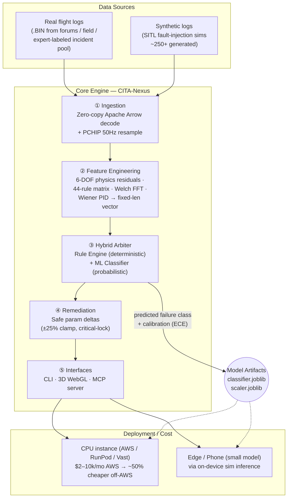
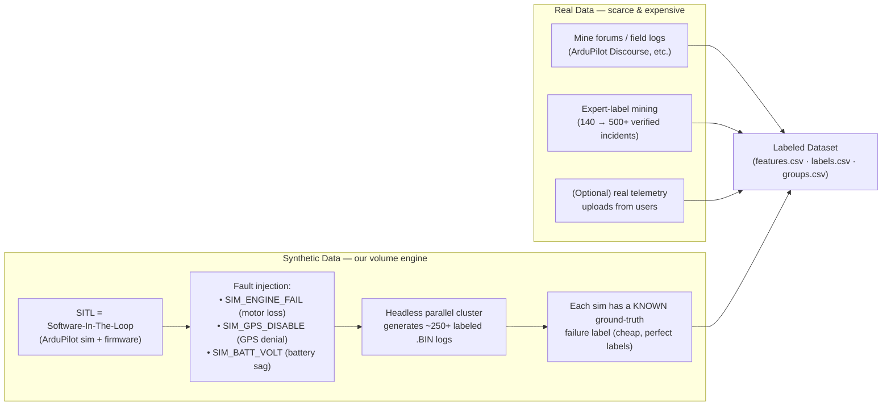
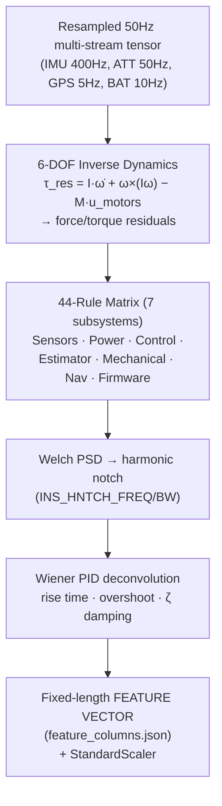
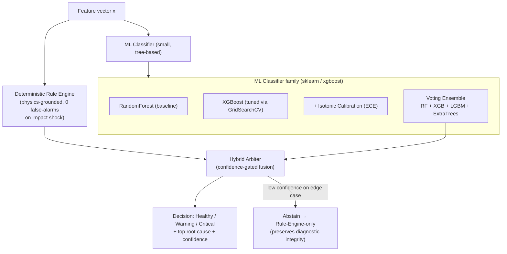
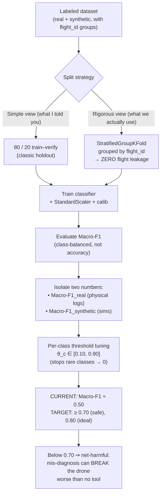
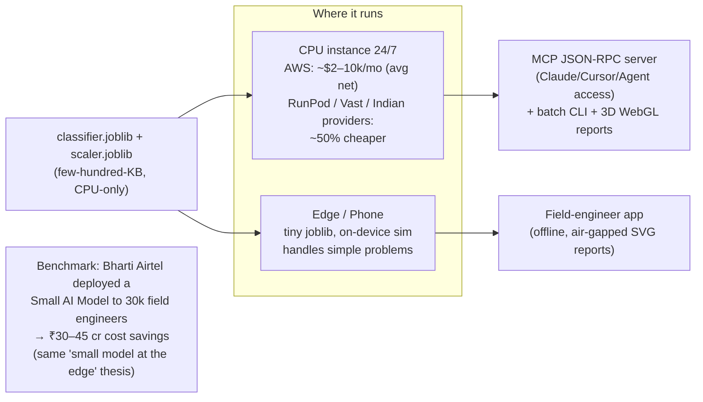

# CITA‑Nexus — Mentor Briefing (Zero‑Explanation Flowchart Pack)

> **Audience:** AI/ML‑literate mentor (strong on model training, less familiar with the
> drone‑log domain or this repo's internal architecture).
> **Goal:** After reading this single document you should understand the *whole* project,
> the *model we actually built*, *why accuracy is where it is*, and *how it is deployed/costed* —
> without any further back‑and‑forth.
> **Repo:** `ardupilot-log-diagnosis` (codename **CITA‑Nexus**), MIT, GSoC 2026 candidate.

---

## 0. TL;DR (read this first)

We built an **automated root‑cause diagnostic engine for ArduPilot drone flight logs**
(`.BIN` DataFlash telemetry). A pilot hands over a crashed/failed flight log; the system
returns *what broke, when, why, and how to fix it* — in under 250 ms on CPU.

It is **NOT** a VLA (Vision‑Language‑Action) model. It is a **small, edge‑deployable
ML classifier** ("SLM‑class" in size) built on top of a **deterministic physics rule engine**.
Think: a tiny gradient‑boosted tree model that consumes a vector of physics/engineering
features — not a billion‑parameter LLM. That is why it fits on a phone and runs on cheap CPU.

**Current state:** held‑out **macro‑F1 ≈ 0.50**. Hard requirement for safe deployment is
**≥ 0.70** (ideally 0.80), because *below ~0.70 the model is net‑harmful* — it mis‑diagnoses
and can worsen a drone's setup more than leaving it alone.

---

## 1. Master End‑to‑End Flow

**Why this shape:** the deterministic rule engine guarantees *zero false‑alarm* on the
post‑crash impact shock (a classic ML trap), while the ML layer catches the *subtle,
multi‑signal* failures rules miss. They arbitrate, they don't replace each other.

---

## 2. Data Generation (where the 250 sims come from)

This is the part most people get wrong about the project. **We do not have 1M real
crashed logs.** We *manufacture* labeled training data two ways:

**Key insight for the mentor:** synthetic data gives us *perfect labels for free*, but it
comes from a *simulator distribution*. That simulator gap is the single biggest reason our
**real‑world accuracy collapses to ~0.5** when the model meets logs it wasn't generated from
(the "0.5%" panic in our chat was test data drawn from a very different distribution than
training). This is a textbook **train/serve distribution shift**, not a model‑capacity problem.

---

## 3. Feature Engineering (the actual model input)

The classifier never sees raw bytes. It sees an engineered vector:

These features are what `train_model.py` and `ml_classifier.py` consume. The *same* vector
is produced at inference time from a real uploaded `.BIN`, so train/serve feature code is identical.

---

## 4. Model Architecture (what "the model" actually is)

**Size/complexity:** this is a **Small Model (SLM‑class)** — a few hundred KB joblib of
gradient‑boosted trees, not a transformer. That is the whole point of the "small model on
the phone" comment: it runs in milliseconds on a CPU, no GPU, no API call.

---

## 5. Training & Evaluation (the 0.50 → 0.70 problem)

This is the exact part of our chat ("80/20", "macro F1", "0.5 vs 0.5%"):

**Why Macro‑F1 and not accuracy:** failure classes are heavily imbalanced (most flights are
"healthy"; a few failure modes are rare). Plain accuracy hides the fact that we predict
"healthy" all day. *Macro‑F1 weights every class equally* — that's the honest metric, and
it's why the bar is 0.70.

**Why 0.50 today:** (a) synthetic↔real distribution shift (Section 2), (b) rare classes
starved of real examples, (c) threshold/leakage still being tightened. The fix path is
*more diverse real labels + domain adaptation*, **not** a bigger model.

---

## 6. Deployment, Cost & "Small Model on Phone"

**Cost note (from our chat):** the model is *cheap to serve* precisely because it's small
and CPU‑bound. A 24/7 CPU box on AWS is the expensive end (~$2–10k/mo with networking);
RunPod/Vast/Indian providers roughly halve that. There is **no GPU bill**, no per‑token LLM
cost — that's the economic argument for an SLM over a hosted LLM/VLA.

---

## 7. Glossary — chat slang → technical term

| What I said in chat | Actual meaning in the repo |
|---|---|
| "generated this type of data" | SITL fault‑injection simulation logs (synthetic, perfectly labeled) |
| "CPU instance 2–10k" | 24/7 CPU serving cost; RunPod/Vast ~50% cheaper |
| "0.5 / 50%" | **Macro‑F1 ≈ 0.50** (not 0.5%) on held‑out data |
| "0.5% on 250 sims" | score collapsed to ~0.5% when test data was *very different* from generated data (distribution shift) |
| "80/20" | classic 80% train / 20% verify holdout (we also use StratifiedGroupKFold) |
| "macro f1 0.7" | safe deployment threshold (Macro‑F1 ≥ 0.70) |
| "SLM / small model / phone" | small tree‑based classifier, CPU/edge deployable, not an LLM |
| "na, not a VLA" | it is **not** a Vision‑Language‑Action model |
| "can break the drone" | below 0.70 macro‑F1 the model is net‑harmful (mis‑remediation) |
| "Airtel small AI model" | real‑world proof point for small‑model‑at‑the‑edge economics |

---

## 8. One‑Paragraph Explanation You Can Paste

> CITA‑Nexus is an automated root‑cause diagnostic engine for ArduPilot drone flight logs.
> We parse `.BIN` telemetry with a zero‑copy Arrow pipeline, engineer physics features
> (6‑DOF residuals, a 44‑rule matrix, spectral and PID analysis), and feed them to a **small
> hybrid model** = deterministic rule engine + a gradient‑boosted tree classifier (RandomForest/
> XGBoost/ensemble, ~few‑hundred‑KB joblib). Training data is mostly *synthetic* (SITL fault
> injection, ~250+ perfectly‑labeled logs) plus a smaller pool of real expert‑labeled incidents.
> We evaluate with **Macro‑F1 under StratifiedGroupKFold** (no flight leakage) and currently sit
> at ≈0.50; the safety bar is ≥0.70 because below that the model mis‑diagnoses and can damage the
> drone. It's deliberately **small and CPU/edge‑deployable** (phone, cheap RunPod/Vast instances),
> not a VLA or LLM — which is what makes it economical to run 24/7.

---

*Generated for mentor hand‑off. All diagrams are Mermaid and render on GitHub, VS Code, and
most Markdown viewers. No code was changed to produce this document.*
