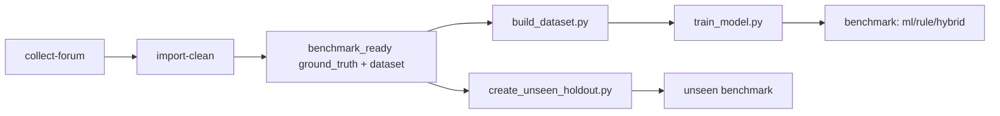
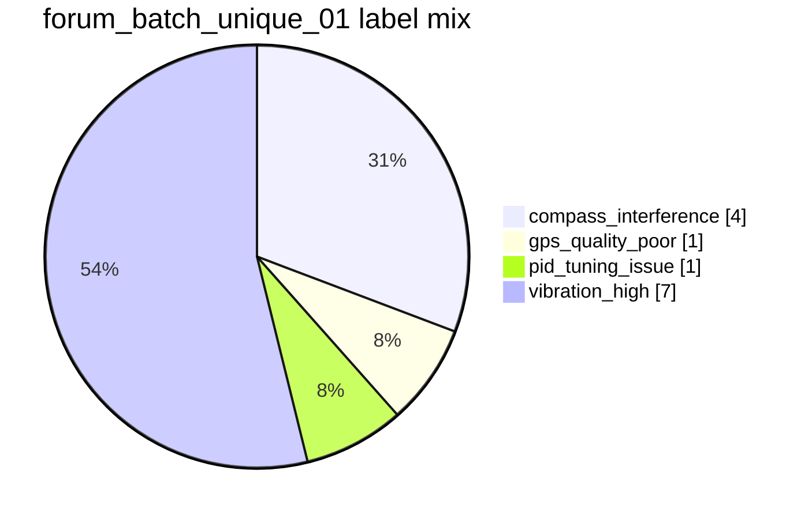
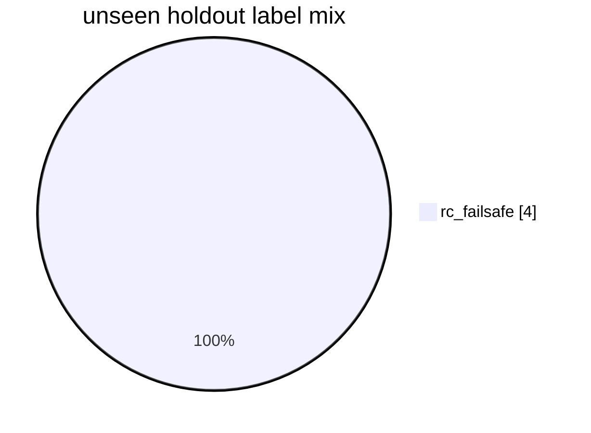

# ArduPilot Log Diagnosis - Progress Showcase

## Current Status
- Data pipeline is stable end-to-end (collection -> clean import -> training -> benchmarking).
- SHA-based dedupe removed repeated samples and improved in-scope benchmark quality.
- Provenance audit found no missing source/download/hash metadata in verified benchmark logs.
- Real unseen holdout is now separated by SHA hash with zero overlap against training hashes.

## Pipeline Visual

## Benchmark Timeline
| Run | Logs | Exact-match Accuracy | Macro F1 | Artifact |
|---|---:|---:|---:|---|
| Legacy baseline (repo root) | 10 | 0.10 | 0.20 | `benchmark_results.json` |
| Local batch 01 (ML) | 12 | 0.00 | 0.41 | `data/clean_imports/forum_batch_local_01/benchmark_ready/benchmark_results_ml.json` |
| Merged 01 (ML) | 21 | 0.67 | 0.23 | `data/clean_imports/forum_batch_merged_01/benchmark_ready/benchmark_results_ml.json` |
| SHA-unique 01 (ML) | 13 | 0.69 | 0.43 | `data/clean_imports/forum_batch_unique_01/benchmark_ready/benchmark_results_ml.json` |
| Unseen holdout (ML) | 4 | 0.00 | 0.00 | `data/holdouts/lockbox_unseen_2026-02-23/benchmark_results_ml.json` |
| Unseen holdout (Hybrid) | 4 | 0.00 | 0.00 | `data/holdouts/lockbox_unseen_2026-02-23/benchmark_results_hybrid.json` |
| Unseen holdout (Rule) | 4 | 0.00 | 0.00 | `data/holdouts/lockbox_unseen_2026-02-23/benchmark_results_rule.json` |

## Label Coverage by Batch
| Batch | Trainable Logs | Label Distribution |
|---|---:|---|
| forum_batch_local_01 | 12 | `{'compass_interference': 4, 'gps_quality_poor': 1, 'vibration_high': 7}` |
| forum_batch_local_02 | 9 | `{'gps_quality_poor': 1, 'pid_tuning_issue': 1, 'vibration_high': 7}` |
| forum_batch_local_03 | 9 | `{'gps_quality_poor': 1, 'pid_tuning_issue': 1, 'vibration_high': 7}` |
| forum_batch_unique_01 | 13 | `{'compass_interference': 4, 'gps_quality_poor': 1, 'pid_tuning_issue': 1, 'vibration_high': 7}` |

### Training Label Mix

### Unseen Holdout Label Mix

## Data Integrity Audit (Fabrication Risk Checks)
Automated checks performed:
- Each benchmark log links to a verified manifest row.
- `source_url` exists and is from `discuss.ardupilot.org`.
- `resolved_download_url` exists.
- `sha256` exists and is 64 hex chars.
- Synthetic/SITL sources are not present in verified benchmark labels.

| Batch | GT Logs | Linked Rows | Issue Count |
|---|---:|---:|---:|
| forum_batch_local_01 | 12 | 12 | 0 |
| forum_batch_local_02 | 9 | 9 | 0 |
| forum_batch_local_03 | 9 | 9 | 0 |
| flight_logs_dataset_2026-02-22 | 2 | 2 | 0 |

## Real Unseen Data
- Training hash count: **13**
- Holdout hash count: **4**
- Train/holdout SHA overlap: **0**
- Holdout ground truth: `data/holdouts/lockbox_unseen_2026-02-23/ground_truth.json`
- Holdout size caveat: **4 logs** (small holdouts can produce high-variance metrics)

Interpretation:
- Overlap `0` means holdout logs are hash-unseen relative to the training set.
- This is suitable for mentor-facing generalization reporting.

## Next Actions
1. Increase minority-class collection (`gps_quality_poor`, `pid_tuning_issue`, `power_instability`, `ekf_failure`).
2. Keep reporting both in-scope and SHA-unseen holdout metrics for each model revision.
3. Add class-balanced training/evaluation split once each target label has >= 5 unique logs.
